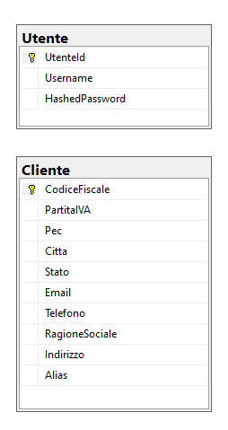

# Documentazione del Backend del Progetto Gestionale

## Indice

1. [Introduzione](#1-introduzione)
2. [Tecnologie Utilizzate](#2-tecnologie-utilizzate)
3. [Architettura del Backend](#3-architettura-del-backend)
4. [Modelli dei Dati](#4-modelli-dei-dati)
5. [API](#5-api)
6. [Autenticazione e Autorizzazione](#6-autenticazione-e-autorizzazione)
7. [Logging e Monitoraggio](#7-logging-e-monitoraggio)
8. [Gestione delle Eccezioni](#8-gestione-delle-eccezioni)
9. [Testing](#9-testing)
10. [Deployment](#10-deployment)
11. [Conclusione](#11-conclusione)

## 1. Introduzione
La documentazione seguente fornisce una panoramica dettagliata del backend dell'applicazione, che gestisce le operazioni relative alla registrazione degli utenti, al login, alla gestione dei clienti e alla comunicazione con il database. Il backend è sviluppato utilizzando il framework ASP.NET Core.

## 2. Tecnologie Utilizzate

### Lista Teconologie

[`ASP.NET Core`](#asp-net-core)&ensp;&ensp;&ensp;[`Entity Framework Core`](#entity-framework-core)&ensp;&ensp;&ensp;[`Microsoft SQL Server`](#microsoft-sql-server)&ensp;&ensp;&ensp;[`DotNetEnv`](#dotnetenv)

---

Il backend utilizza diverse tecnologie per implementare le sue funzionalità:

- <a id="asp-net-core"></a>[**ASP.NET Core:**](https://dotnet.microsoft.com/apps/aspnet) È il framework utilizzato per lo sviluppo dell'applicazione web.
- <a id="entity-framework-core"></a>[**Entity Framework Core:**](https://docs.microsoft.com/en-us/ef/core/) È un ORM (Object-Relational Mapping) utilizzato per interagire con il database relazionale.
- <a id="microsoft-sql-server"></a>[**Microsoft SQL Server:**]( https://www.microsoft.com/en-us/sql-server)  È il database relazionale utilizzato per memorizzare i dati dell'applicazione.
- <a id="dotnetenv"></a>[**DotNetEnv:**](https://github.com/tonerdo/dotnet-env) È una libreria utilizzata per caricare le variabili d'ambiente da un file .env. Questa libreria è stata utilizzata per la configurazione del server e del database, permettendo di impostare come variabili globali i dati necessari al setup e all'avvio di entrambi. Ciò consente una gestione efficiente e flessibile delle configurazioni di ambiente nel backend.
  
## 3. Architettura del Backend


### Indice

1. [Organizzazione dei Componenti](#organizzazione-dei-componenti)
2. [Vantaggi Strutturali](#vantaggi-strutturali)
3. [Struttura dei File in un Albero di Path](#struttura-dei-file-in-un-albero-di-path)

---

### Organizzazione dei Componenti

La struttura del progetto backend si basa sulla separazione dei compiti, con un'opportuna organizzazione delle cartelle per garantire una chiara distinzione tra le responsabilità dei vari componenti.

Ogni componente è organizzato in modo specifico:

1. **Server**:
   
   _Contiene il file principale del server, responsabile della gestione generale del server stesso_
   - **Requests**:
     
     _Contiene gli script per l'elaborazione delle richieste al server, suddivisi in file separati per ogni tipo di richiesta_
     
3. **Database**:
   
   _Contiene il file principale del database, responsabile della connessione e dell'interazione con il database_
   - **Tables**:
     
     _Contiene gli script per la definizione delle tabelle del database, con un file separato per ogni tabella_

5. **App**:
   
   _Il file principale `App.cs` lancia l'applicazione e gestisce l'intero flusso di esecuzione_

Questa organizzazione permette una chiara separazione delle responsabilità, rendendo più facile la comprensione e la manutenzione del codice. Ogni componente ha un ruolo ben definito, con file separati per gestire specifiche funzionalità o aspetti del sistema.

### Vantaggi Strutturali

- **Chiarezza e Separazione dei Compiti**: La struttura organizzativa permette una chiara separazione delle responsabilità tra server, richieste e database, facilitando la comprensione del codice e la risoluzione dei problemi.
  
- **Facilità di Manutenzione**: Grazie alla suddivisione in cartelle e file separati per ciascun componente, la manutenzione del codice diventa più semplice e intuitiva.

- **Scalabilità e Riutilizzo del Codice**: La struttura ben organizzata facilita il riutilizzo dei componenti in altre parti dell'applicazione o in progetti futuri, migliorando la scalabilità e l'efficienza dello sviluppo.

- **Migliore Gestione del Database**: La separazione dei file del database permette una gestione più efficiente delle tabelle e delle relazioni, semplificando l'interazione con il database e garantendo una migliore manutenibilità nel tempo.

Questa struttura organizzativa contribuisce a un codice più chiaro, manutenibile e scalabile, promuovendo una maggiore efficienza nello sviluppo e nella gestione del backend dell'applicazione.

### Struttura dei File in un Albero di Path

Di seguito è descritta la struttura delle cartelle e dei file del frontend, inclusi i componenti:

- **Server**
  
   _Directory principale del progetto con il resto dei file generati automaticamente durante la creazione del progetto React._
  - `App.cs`: _Contiene il gestore del server._

  - **src/**
    
     _Directory principale del codice sorgente._
      - **Server/**
        
        _Contiene tutti gli script C# sviluppati per il server._
        - `Server.cs`: _Contiene il server._
      
      - **Requests/**
        
        _Contiene tutti gli script C# sviluppati per l'elaborazione delle richieste al server._
        - `ListHandler.cs`: _Contiene il gestore della richiesta relativa alla visualizzazione delle anagrafiche dei clienti._
        - `Loginhandler.cs`: _Contiene il gestore della richiesta relativa all'autenticazione dell'utente._
        - `RegisterHandler.cs`: _Contiene il gestore della richiesta relativa alla registrazione di un nuovo cliente._
      
      - **Database/**
        
        _Contiene tutti gli script C# sviluppati per il database._
        - `Database.cs`: _Contiene il database._

        - **Table/**
          
          _Contiene tutti gli script C# sviluppati per il riferimento alle tabelle del database._
          - `Utente.cs`: _Contiene la tabella utente._
          - `Cliente.cs`: _Contiene la tabella cliente._

## 4. Modelli dei Dati

Nel contesto del nostro backend, sono stati sviluppati due modelli principali per gestire e rappresentare i dati in modo efficace. Questi modelli costituiscono la base su cui il nostro sistema opera e forniscono la struttura necessaria per la memorizzazione, l'organizzazione e l'accesso ai dati. Nell'analisi dei dati, esploreremo questi modelli utilizzando diverse prospettive e strumenti analitici per comprendere appieno la loro natura e il loro funzionamento.

### Indice 

1. [Modello Attributi-Valori](#modello-attributi-valori)
2. [Modello Concettuale](#modello-concettuale)
3. [Modello Relazionale](#modello-relazionale)
4. [DDL ](#ddl)
5. [Chiavi Esterne ](#chiavi-esterne)
6. [Query](#query)

---


## Approcci di Analisi

### Modello Attributi Valori 

L'approccio attributi-valori ci consente di analizzare i modelli di dati, identificando gli attributi di ciascuna entità e i relativi valori. Questa metodologia fornisce una visione dettagliata delle proprietà dei dati e delle loro relazioni all'interno del sistema.


#### Utente

| Attributo | Descrizione                              |
|--------------------|---------------------------------------------------|
| UtenteId           | Identificatore univoco dell'utente                |
| Username           | Nome utente dell'utente                           |
| HashedPassword     | Password crittografata dell'utente                |

#### Cliente

| Attributo | Descrizione                              |
|--------------------|---------------------------------------------------|
| Alias              | Alias univoco del cliente                        |
| RagioneSociale     | Ragione sociale del cliente                       |
| CodiceFiscale      | Codice fiscale del cliente                        |
| PartitaIVA         | Partita IVA del cliente                           |
| PEC                | Indirizzo PEC (Posta Elettronica Certificata)    |
| Indirizzo          | Indirizzo del cliente                             |
| Città              | Città del cliente                                 |
| Stato              | Stato del cliente                                 |
| Email              | Indirizzo email del cliente                       |
| Telefono           | Numero di telefono del cliente                    |


### Modello Concettuale

 Nel contesto dell'analisi dei dati, verrà considerato il modello concettuale per comprendere entità, relazioni e regole di dominio sottostanti, identificando i concetti chiave e le interconnessioni tra di essi.


 

 
### Modello Relazionale

Dall'analisi del modello relazionale si studiano le relazioni tra le entità attraverso l'utilizzo di tabelle e vincoli di integrità referenziale, offrendo una visione dettagliata dell'organizzazione e della correlazione dei dati nel sistema.

### DDL

Dal DDL si esamina la definizione dei dati tramite il linguaggio di definizione dei dati (DDL), per comprendere la struttura e le caratteristiche dei dati, insieme ai vincoli e alle regole per la creazione e la modifica.

```plaintext
Testo della casella di testo.
```

```plaintext
Utente(
  UtenteId,
  Username,
  HashedPassword
)

```


```
Cliente(
  Alias,
  RagioneSociale,
  CodiceFiscale,
  PartitaIVA,
  PEC,
  Indirizzo,
  Città,
  Stato,
  Email,
  Telefono  
)
```

### Chiavi Esterne

Dalle chiavi esterne è possibile stabilire relazioni tra tabelle, garantendo l'integrità referenziale e facilitando l'organizzazione dei dati nel database.

> [!WARNING]  
> Nel sistema attuale, non sono state utilizzate chiavi esterne poiché il gestionale è orientato all'azienda, e gli utenti che operano all'interno dell'azienda gestiscono i clienti aziendali, non i propri.

> [!TIP]
> In possibili sviluppi futuri o personalizzazioni del software su richiesta del committente, potrebbe essere implementato un sistema di chiavi esterne per associare i clienti all'utente di riferimento e, eventualmente, consentire a più utenti di condividere gli stessi clienti. Questo consentirebbe una gestione più flessibile dei dati e una maggiore adattabilità alle esigenze specifiche dell'azienda.

### Query

Dall'analisi delle query utilizzate per recuperare e manipolare i dati nel sistema è possibile avere una comprensione delle operazioni di estrazione e elaborazione dei dati per soddisfare le esigenze funzionali del sistema di backend.
  
## 5. API

Il backend espone diverse API per consentire al client di interagire con le risorse del sistema:

| API                  | Tipo    | Descrizione                                                 |
|----------------------|---------|-------------------------------------------------------------|
| **`/autenticaUtente`**       | **POST**                  | Gestisce il processo di **autenticazione dell'utente** con opportuni controlli per [gestire le eccezioni](#autenticazione-utente). |
| **`/registraCliente`**      |**POST**                       | Gestisce la **registrazione di un cliente** con opportuni controlli per [gestire le eccezioni](#registrazione-cliente). |
| **`/visualizzaClienti`**           | **GET**      | Restituisce la **visualizzazione dei clienti** memorizzati nel database con opportuni controlli per [gestire le eccezioni](#visualizzazione-clienti). |


> [!NOTE]  
> Per informazioni dettagliate sulla gestione degli errori per le singole API consultare il paragrafo di [Gestione delle Eccezioni](#8-gestione-delle-eccezioni).


## 6. Autenticazione e Autorizzazione

Il backend implementa un meccanismo di autenticazione basato su **username e password**. Le credenziali degli utenti vengono verificate nel database e, se corrette, viene restituito un **token di accesso** per le successive richieste. Per garantire la sicurezza delle credenziali degli utenti e dei dati scambiati tra client e server, è stato utilizzato l'algoritmo di crittografia **SHA3**.

Una volta autenticato con successo, il **token di accesso** viene restituito al client e utilizzato per memorizzare l'accesso nella cache dell'utente. In questo modo, l'utente può accedere al sistema senza dover reinserire le credenziali ad ogni richiesta successiva. Inoltre, il **token di accesso** viene utilizzato per abilitare i permessi necessari per effettuare le richieste che richiedono l'accesso. Questo meccanismo di autenticazione e autorizzazione aiuta a garantire la sicurezza e l'integrità del sistema, proteggendo i dati sensibili degli utenti e prevenendo accessi non autorizzati.

## 7. Logging e Monitoraggio

Il backend utilizza i registri per registrare eventi importanti e informazioni di debug. I registri vengono salvati in file di log per consentire il monitoraggio delle attività e la risoluzione dei problemi.

## 8. Gestione delle Eccezioni

### Indice 

1. [Globale](#Globale)
2. [Autenticazione Utente](#autenticazione-utente)
3. [Registrazione Cliente](#registrazione-cliente)
4. [Visualizzazione Clienti](#visualizzazione-clienti)

---

### Codici di stato HTTP 

Il backend gestisce le eccezioni in modo appropriato, restituendo codici di stato HTTP appropriati e fornendo informazioni dettagliate sugli errori al [client](frontend.md#8-gestione-delle-eccezioni). Ciò aiuta a garantire una gestione sicura e robusta delle richieste, fornendo al client tutte le informazioni necessarie per comprendere e gestire correttamente gli errori durante le interazioni con il backend.

#### Globale

- **`200` (OK):** Operazione completata con successo e le modifiche sono state salvate nel database.
- **`404` (Not Found):** Impossibile accedere al server. La risorsa richiesta non è stata trovata.
- **`500` (Internal Server Error):** Si è verificato un errore interno.

#### Autenticazione Utente

- **`405` (Method Not Allowed):** Risposta in caso la password fornita non è corretta.
- **`409` (Conflict):** Risposta in caso l'utente non esista nel sistema.
  
#### Registrazione Cliente

- **`409` (Conflict):** Il codice fiscale fornito è già presente nel sistema.
- **`400` (Bad Request):** I dati forniti per la registrazione non sono validi.

#### Visualizzazione Clienti

- **`500` (Internal Server Error):** Si è verificato un errore interno durante il recupero dell'elenco dei clienti.

> [!WARNING]  
> La gestione delle eccezioni è contestualizzata all'API di riferimento quindi a stessi codici di stato HTTP in diverse API corrispondono errori diversi

# 9. Testing

Breve panoramica dei test effettuati sul lato server dell'applicazione.

## Indice

1. [Test Effettuati](#test-effettuati)
2. [Benefici dei Test](#benefici-dei-test)
3. [Esito dei Test](#esito-dei-test)

---

## Test Effettuati

- **Test Unitari**: Sono stati implementati test unitari per verificare il corretto funzionamento dei singoli metodi e delle classi utilizzate nel server dell'applicazione. Questi test hanno consentito di individuare bug e garantire che ogni componente si comporti come previsto in varie condizioni.

- **Test di Integrazione**: Sono stati eseguiti test di integrazione per verificare l'interazione tra diversi moduli e le varie parti del server. Questi test sono stati utili per assicurare che i vari moduli del server funzionino correttamente insieme e che non vi siano problemi di compatibilità o conflitti tra di essi.


> [!NOTE]
> - La complessità del progetto non ha richiesto l'utilizzo di framework esterni per il testing come NUnit o xUnit.
> 
> - L'[architettura del Backend](#3-architettura-del-backend) in termini di organizzazione del codice ha facilitato la manutenibilità a livello di test, consentendo di scrivere e mantenere i test in modo efficiente.
## Benefici dei Test

- **Miglioramento della Qualità**: I test hanno contribuito a migliorare la qualità complessiva del server dell'applicazione, individuando e risolvendo bug e problemi prima che possano influenzare il funzionamento dell'applicazione.

- **Riduzione dei Rischi**: Effettuando test regolari, si è ridotto il rischio di errori e malfunzionamenti nel server, garantendo un'esperienza più stabile per gli utenti.

- **Aumento della Fiducia**: L'utilizzo di test ha aumentato la fiducia nello sviluppo e nella manutenzione del server, fornendo una valida garanzia che ogni cambiamento o aggiornamento non causi regressioni o problemi imprevisti.

## Esito dei Test

Tutti i test hanno avuto **esito positivo**, confermando la **stabilità della build** e quindi l'affidabilità del server dell'applicazione.


# 10. Deployment

Per il deployment del backend, è necessario seguire una serie di passaggi che includono la compilazione del codice, la creazione dei pacchetti di distribuzione e la configurazione dell'ambiente di produzione e dei servizi necessari per il funzionamento dell'applicazione. Sono disponibili diverse opzioni di deployment, tra cui il deployment su server fisici, server virtuali o servizi cloud.

## Indice

1. [Configurazione dell'Ambiente di Produzione](#1-configurazione-ambiente-di-produzione)
2. [Configurazione del Server](#2-configurazione-del-server)
3. [Compilazione e Pacchettizzazione del Codice](#3-compilazione-e-pacchettizzazione-del-codice)
4. [Configurazione Applicazione](#4-configurazione-applicazione)
5. [Configurazione di SQL Server](#5-configurazione-di-slq-server)
6. [Abilitazione Accesso Remoto a SQL Server](#6-abilitazione-accesso-remoto-a-sql-server)
7. [Avvio del Server](#7-avvio-del-server)
8. [Test](#8-test)

---

Per la configurazione di SMSS e Microsoft SQL Server con le specifiche per l'avvio del server dotnet e le configurazioni per ASP.NET Core, seguire i dettagli riportati di seguito:

## 1. Configurazione Ambiente di Produzione

- Assicurarsi di avere un'istanza funzionante di Microsoft SQL Server e avere accesso a SQL Server Management Studio (SMSS) per gestire il database.
- Installare e configurare DotNetEnv per caricare le variabili d'ambiente da un file .env.

## 2. Configurazione del Server

Configurare il server per ospitare l'applicazione ASP.NET Core con .NET Core SDK e ASP.NET Core Hosting Bundle.

## 3. Compilazione e Pacchettizzazione del Codice

- Compilare il codice sorgente dell'applicazione utilizzando il comando:
  
   ```
   dotnet build
   ```
- Creare un pacchetto di distribuzione specificando il framework di destinazione e il tipo di pacchetto desiderato utilizzando il comando.
  
   ```
   dotnet publish
   ```
  
## 4. Configurazione Applicazione

- Modificare il file di configurazione dell'applicazione (`appsettings.json` o `appsettings.{Environment}.json`) per includere le informazioni di connessione al database SQL Server.
- Utilizzare DotNetEnv per caricare le variabili d'ambiente dal file `.env` all'avvio dell'applicazione.

## 5. Configurazione di SQL Server

1. Installa “SQL Server” seguendo le istruzioni di installazione.
2. Dopo l'installazione, cerca "SQL Server Configuration Manager" nella barra di ricerca e aprilo.
3. Nella finestra di SQL Server Configuration Manager, vai su "Servizi di SQL Server".
4. Verifica lo stato dei servizi "SQL Server (MSSQLSERVER)" e "SQL Server Browser". Se sono arrestati, fai clic destro su ciascuno e seleziona "Avvia".
5. Se la modalità di avvio è impostata su "Disabilitato", fai clic destro sul servizio, seleziona "Proprietà", vai su "Servizio" e impostalo su "Manuale" o "Automatico". Poi avvialo seguendo il procedimento descritto al punto 4.
6. Ora vai su "Configurazione di rete SQL Server" e seleziona "Protocolli per MSSQLSERVER".
7. Abilita "Memoria Condivisa" e "TCP/IP".
Se hai impostato la modalità di avvio su "Manuale", dovrai avviare manualmente i servizi ogni volta che avvii il computer seguendo il procedimento descritto al punto 4.

### 6. Abilitazione Accesso Remoto a SQL Server

1. Installa “SQL Server Management Studio (SSMS)” seguendo le istruzioni di installazione.
2. Dopo l’installazione, accedi tramite l’Autenticazione di Windows.
3. Premi il tasto destro sul nodo principale dell'albero e vai su Proprietà > Sicurezza e imposta l’Autenticazione server su Autenticazione di SQL Server e di Windows.
4. Dopodiché, vai su nodo principale (o nome del server) > Sicurezza > Account di accesso, premi tasto destro su Account di accesso > Nuovo account di accesso.
5. Su Generale:
   - Inserisci il Nome account di accesso (che sarà il Nome utente).
   - Abilita Autenticazione di SQL Server.
   - Inserisci la password e la conferma password.
   - Disabilita “Richiedi modifica della password all’accesso successivo”.
6. Vai su Ruoli del server e premi su sysadmin.
7. Vai su Mapping utente e premi sul checkbox di master e il database che verrà utilizzato.
8. Premi OK.
9. Per verificare l'accesso remoto, è necessario riavviare SSMS e, nel form, selezionare "Autenticazione" > "Autenticazione di Windows", quindi inserire il Nome utente e la password nei campi appropriati. In caso di errore, assicurarsi di aver seguito correttamente i passaggi indicati. Se l'errore persiste, è consigliabile contattarci o consultare un professionista per assistenza.


## 7. Avvio del Server

Avviare il server ASP.NET Core specificando il file principale dell'applicazione `App.cs`utilizzando il comando:
  
```
dotnet run
```

## 8. Test

- Verificare che l'applicazione sia accessibile e funzionante nel browser o tramite richieste API.

> Seguendo questi passaggi, sarà possibile configurare un ambiente di deployment per un'applicazione ASP.NET Core utilizzando SQL Server come database e DotNetEnv per la gestione delle variabili d'ambiente. Assicurarsi di documentare attentamente i passaggi e di effettuare test approfonditi prima di mettere in produzione l'applicazione.


## 11. Conclusione

La documentazione fornita offre una panoramica completa del backend dell'applicazione, illustrando le sue funzionalità, la sua architettura e le tecnologie utilizzate. Il backend è progettato per essere robusto, sicuro e scalabile, garantendo un'esperienza utente ottimale e una gestione efficiente dei dati dell'applicazione.

### Indice

1. [Ringraziamenti](#ringraziamenti)
2. [Riferimenti aggiuntivi](#riferimenti-aggiuntivi)
3. [Supporto e collaborazione futura](#supporto-e-collaborazione-futura)

---

### Ringraziamenti

Desideriamo ringraziare il team di sviluppo per il loro impegno e dedizione nel portare avanti questo progetto. 

| Ruolo          | Nome            | Email                        | GitHub                                           |
|----------------|-----------------|------------------------------|-----------------------------------------------|
| Gestore Backend| Reda Karimi     | redakarimi76@gmail.com      | [redakarimi](https://github.com/redakarimi)  |
| Gestore Frontend| Vittorio Piotti| vittoriopiotti.vp@gmail.com | [vittoriopiotti](https://github.com/vittoriopiotti) |


### Riferimenti aggiuntivi

Per contribuire al progetto, ricevere informazioni o segnalare bug fare riferimento ai seguenti link:


| Issues Repository GitHub                        | Email Aziendale                  | Email Privata                  |
|------------------------------------------|---------------------------------|--------------------------------|
| [Repository](https://github.com/pub) | gestionale.dev@gmail.com                | redakarimi76@gmail.com                        |
|  |                |                           vittoriopiotti.vp@gmail.com     |


### Supporto e collaborazione futura

Siamo aperti a nuove collaborazioni e siamo disponibili a offrire supporto per l'implementazione del progetto in altri contesti o per eventuali miglioramenti futuri. Non esitate a contattarci per ulteriori dettagli o proposte di collaborazione.

Grazie ancora a tutti coloro che hanno reso possibile il successo di questo progetto!


> [!NOTE]
> Consultare il [readme](readme.md) per ulteriori informazioni.


