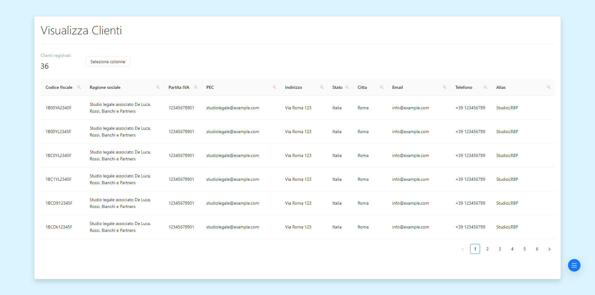

# Documentazione del Frontend

## Indice

1. [Introduzione](#1-introduzione)
2. [Tecnologie Utilizzate](#2-tecnologie-utilizzate)
3. [Struttura del Progetto](#3-struttura-del-progetto)
4. [Componenti Principali](#4-componenti-principali)
5. [Routing](#5-routing)
6. [Gestione dello Stato](#6-gestione-dello-stato)
7. [Chiamate API](#7-chiamate-api)
8. [Stili](#8-stili)
9. [Testing](#9-testing)
10. [Avvio e Sviluppo Locale](#10-avvio-e-sviluppo-locale)
11. [Distribuzione](#11-distribuzione)
12. [Conclusione](#12-conclusione)

## 1. Introduzione

Il frontend del progetto "Gestionale" offre un interfaccia userfriendly che consente agli utenti preregistrati di gestire la registrazione dei propri clienti e la visualizzazione della lista delle loro anagrafiche:

1. **Accesso Utente**:
   
   
   
   - L'utente effettua il login al sistema da **account unici preregistrati** 
   - Degli account utente le **credenziali sono criptate con SHA3**
   - Il sistema garantisce una **gestione sicura per l'apertura delle pagine sensibili** tramite la cache in cui viene memorizzato l'accesso dell'utente tenendolo in memoria in modo che se non è presente allora impedisce l'ingresso in qualsiasi form che non sia quello di autenticazione.

3. **Registrazione Clienti**:
   
   
   
   Gli utenti possono registrare i propri clienti nel sistema che li identifica sulla base del loro codice fiscale.
   
5. **Visualizzazione Clienti**:
   
   

   Gli utenti possono visualizzare in modo massivo o nel dettaglio le anagrafiche dei propri clienti con le seguenti features:
   
   - Si possono selezionare quali campi rendere visibili e quali oscurare 
   - Si possono filtrare i clienti da visualizzare con un sistema di ricerca abilitato su ogni campo

## 2. Tecnologie Utilizzate
Elenco delle principali tecnologie utilizzate nel frontend, come React, Redux, etc.

## 3. Struttura del Progetto
Descrizione della struttura delle cartelle e dei file del frontend, inclusi componenti, pagine e servizi

- **Client**

   _Directory principale del progetto con il resto dei file generati automaticamente in fase di creazione del progetto react ._
  - **src/**
    
     _Directory principale del codice sorgente._
    - **script/**

       _Contiene tutti gli script js sviluppati._
      - **extra/**

         _Contiene gli script secondari utilizzati nei file principali._
        - **design/**

           _Contiene gli script dei componenti grafici secondari riutilizzati in più schermate._
          - **FloatButton/**

             _Contiene gli script per il funzionamento del menu di navigazione del sito._
            - `FloatButtonApp.js`: _Script che istanzia ed usa il main al fine di migliorare la visibilità e la coerenza del codice._
            - `FloatButtonMain.js`: _Script che istanzia ed usa il manager e la view unendo la parte logica e quella grafica del componente cosi da garantirne il funzionamento ed una corretta separazione dei compiti mantenendo la parte logica e quella grafica separate._
            - `FloatButtonManager.js`: _Script che gestisce la logica e l'elaborazione dei dati della view._
            - `FloatButtonView.js`: _Script che contiene la vista del componente e ne gestisce solo la grafica._
        - **utility/**

           _Contiene gli script che sono i gestori per l'elaborazione dei dati e vengono riutilizzati nei componenti principali._
          - `RequestManager.js`: _Componente per la gestione delle richieste GET e POST dal frontend al server._
          - `WindowLoader.js`: _Gestisce l'animazione di caricamento delle pagine web._

      - **features/**

         _Contiene i componenti funzionali del progetto._
        - **autenticaCliente/**
          
             _Contiene gli script per il form di autenticazione dell'utente._
            - `AutenticaClienteApp.js`: _Script che istanzia ed usa il main al fine di migliorare la visibilità e la coerenza del codice._
            - `AutenticaClienteMain.js`: _Script che istanzia ed usa il manager e la view unendo la parte logica e quella grafica del componente cosi da garantirne il funzionamento ed una corretta separazione dei compiti mantenendo la parte logica e quella grafica separate._
            - `AutenticaClienteManager.js`: _Script che gestisce la logica e l'elaborazione dei dati della view._
            - `AutenticaClienteView.js`: _Script che contiene la vista del componente e ne gestisce solo la grafica._
              
        - **registraCliente/**
        
             _Contiene gli script per il form di registrazione del cliente._
            - `RegistraClienteApp.js`: _Script che istanzia ed usa il main al fine di migliorare la visibilità e la coerenza del codice._
            - `RegistraClienteMain.js`: _Script che istanzia ed usa il manager e la view unendo la parte logica e quella grafica del componente cosi da garantirne il funzionamento ed una corretta separazione dei compiti mantenendo la parte logica e quella grafica separate._
            - `RegistraClienteManager.js`: _Script che gestisce la logica e l'elaborazione dei dati della view._
            - `RegistraClienteView.js`: _Script che contiene la vista del componente e ne gestisce solo la grafica._
              
        - **visualizzaClienti/**
          
             _Contiene gli script per il form di visualizzazione delle anagrafiche dei clienti._
            - `VisualizzaClientiApp.js`: _Script che istanzia ed usa il main al fine di migliorare la visibilità e la coerenza del codice._
            - `VisualizzaClientiMain.js`: _Script che istanzia ed usa il manager e la view unendo la parte logica e quella grafica del componente cosi da garantirne il funzionamento ed una corretta separazione dei compiti mantenendo la parte logica e quella grafica separate._
            - `VisualizzaClientiManager.js`: _Script che gestisce la logica e l'elaborazione dei dati della view._
            - `VisualizzaClientiView.js`: _Script che contiene la vista del componente e ne gestisce solo la grafica._
    
      - **UI/**

         _Contiene il gestore dei componenti funzionali._
         - `UIApp.js`: _Script che istanzia ed usa il main al fine di migliorare la visibilità e la coerenza del codice._
         - `UIMain.js`: _Script che istanzia ed usa il manager e la view unendo la parte logica e quella grafica del componente cosi da garantirne il funzionamento ed una corretta separazione dei compiti mantenendo la parte logica e quella grafica separate._
         - `UIManager.js`: _Script che gestisce la logica e l'elaborazione dei dati della view._
         - `UIView.js`: _Script che contiene la vista del componente e ne gestisce solo la grafica, cotiene il sistema di [routing](#5-routing)._

    - **style/**

       _Contiene tutti i fogli di stile css sviluppati._
       - `global.css`: _Foglio di stile con gli stili globali per tutto il progetto._
      - `autenticaUtente.css`: _Foglio di stile con gli stili relativi alla schermata di autenticazione dell'utente._
      - `registraCliente.css`: _Foglio di stile con gli stili relativi alla schermata di registrazione del cliente._
      - `visualizzaClienti.css`: _Foglio di stile con gli stili relativi alla schermata di visualizzazione dei clienti._
      - `menuLaterale.css`: _Foglio di stile con gli stili relativi al componente del menu di navigazione._

## 4. Componenti Principali
Elenco e descrizione dei componenti principali utilizzati nel frontend, con eventuali screenshot e descrizione.

| Nome Form                                | Descrizione Form                                                                                                                                                                                                                                                                                                                                                                                  | Immagine Form                                |
|------------------------------------------|---------------------------------------------------------------------------------------------------------------------------------------------------------------------------------------------------------------------------------------------------------------------------------------------------------------------------------------------------------------------------------------------------|---------------------------------------------|
| Form di autenticazione utente            | <ul><li>L'utente effettua il login al sistema da <strong>account unici preregistrati</strong></li><li>Degli account utente le <strong>credenziali sono criptate con SHA3</strong></li><li>Il sistema garantisce una <strong>gestione sicura per l'apertura delle pagine sensibili</strong> tramite la cache in cui viene memorizzato l'accesso dell'utente tenendolo in memoria in modo che se non è presente allora impedisce l'ingresso in qualsiasi form che non sia quello di autenticazione.</li></ul> |  |
| Form di registrazione cliente           | Gli utenti possono registrare i propri clienti nel sistema che li identifica sulla base del loro codice fiscale.                                                                                                                                                                                                                                                               |  |
| Form di visualizzazione anagrafiche cliente | Gli utenti possono visualizzare in modo massivo o nel dettaglio le anagrafiche dei propri clienti con le seguenti features:<ul><li>Si possono selezionare quali campi rendere visibili e quali oscurare</li><li>Si possono filtrare i clienti da visualizzare con un sistema di ricerca abilitato su ogni campo</li></ul>                                                                                                                                                        |  |

## 5. Routing

### Spiegazione del sistema di routing

Nel progetto si ha utilizzato **React Router per gestire il routing** dell'applicazione.

I **componenti importati** da React Router sono i seguenti:

- `BrowserRouter`: Questo componente fornisce il contesto del routing per i componenti figlio. È avvolto intorno all'intera struttura delle rotte.
- `Routes`: Questo componente contiene una serie di `Route` componenti che definiscono le rotte dell'applicazione.
- `Route`: Questo componente definisce una singola rotta dell'applicazione, associando un percorso URL a un componente React.

Il sistema di routing è configurato all'interno del componente `UIView` [(vedi)](#UIView). Le rotte principali dell'applicazione sono definite come seguenti:

### Descrizione delle rotte principali dell'applicazione

- **Rotte Principali**:
  - La rotta principale (`"/"`) è associata al componente `autenticaUtenteApp`. Questa rotta gestisce l'autenticazione dell'utente e viene visualizzata come pagina di accesso.
  - La rotta `"/registraCliente"` è associata al componente `registraClienteApp`. Questa rotta gestisce il processo di registrazione del cliente.
  - La rotta `"/visualizzaClienti"` è associata al componente `visualizzaClientiApp`. Questa rotta gestisce la visualizzazione dei clienti registrati.

## 6. Gestione dello Stato
Descrizione di come viene gestito lo stato dell'applicazione, ad esempio tramite Redux, con esempi di azioni e riduttori.

## 7. Chiamate API
Spiegazione di come vengono effettuate le chiamate API dal frontend, con esempi di utilizzo di librerie come Axios.

## 8. Stili
Descrizione di come vengono gestiti gli stili nel frontend, ad esempio tramite CSS, CSS-in-JS, o librerie come Styled Components.

## 9. Testing
Breve panoramica dei test effettuati sul frontend, inclusi test unitari, di integrazione e di utilizzo di strumenti come Jest e React Testing Library.

## 10. Avvio e Sviluppo Locale
Istruzioni su come avviare il frontend in modalità di sviluppo locale, con eventuali prerequisiti e comandi necessari.

## 11. Distribuzione
Breve guida su come distribuire il frontend in un ambiente di produzione, con eventuali configurazioni o passaggi aggiuntivi necessari.

## 12. Conclusione
Ringraziamenti, riferimenti aggiuntivi e informazioni per il supporto o la collaborazione futura.

