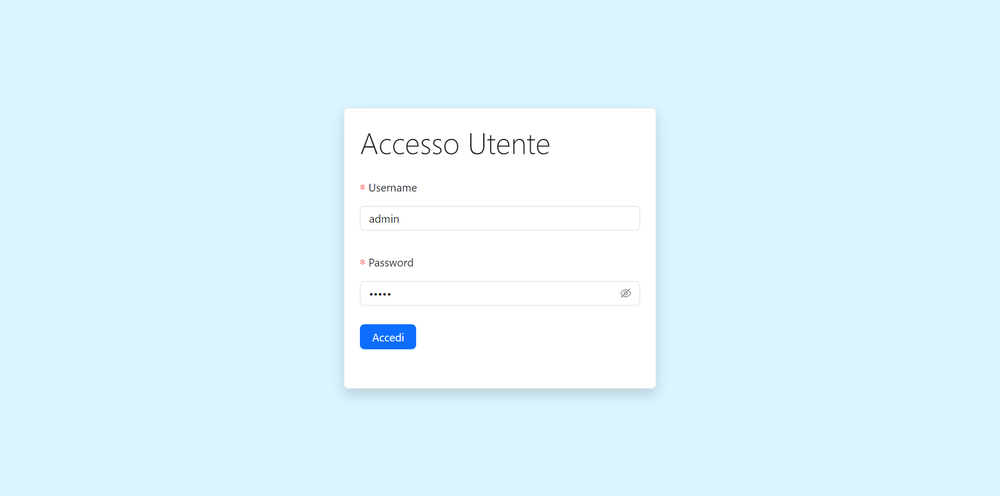

# Documentazione del Progetto Gestionale

## Indice

1. [Descrizione del Progetto](#1-descrizione-del-progetto)
2. [Stato del Progetto](#2-stato-del-progetto)
3. [Installazione](#3-installazione)
4. [Utilizzo](#4-utilizzo)
5. [Documentazione](#5-documentazione)
6. [Contributo](#6-contributo)
7. [Crediti](#7-crediti)
8. [Licenza](#8-licenza)
9. [Contatti](#9-contatti)
10. [Badge](#10-badge)
11. [Recap](#11-recap)

## 1. Descrizione del Progetto:

Il progetto "Gestionale" consente agli utenti preregistrati di gestire la registrazione dei propri clienti e la visualizzazione della lista delle loro anagrafiche:

1. **Accesso Utente**:
   
   
   
   - L'utente effettua il login al sistema da **account unici preregistrati** 
   - Degli account utente le **credenziali sono criptate con SHA3**
   - Il sistema garantisce una **gestione sicura per l'apertura delle pagine sensibili** tramite la cache in cui viene memorizzato l'accesso dell'utente tenendolo in memoria in modo che se non è presente allora impedisce l'ingresso in qualsiasi form che non sia quello di autenticazione.

3. **Registrazione Clienti**:
   
   
   
   Gli utenti possono registrare i propri clienti nel sistema che li identifica sulla base del loro codice fiscale.
   
5. **Visualizzazione Clienti**:
   
   

   Gli utenti possono visualizzare in modo massivo o nel dettaglio le anagrafiche dei propri clienti con le seguenti features:
   
   - Si possono selezionare quali campi rendere visibili e quali oscurare 
   - Si possono filtrare i clienti da visualizzare con un sistema di ricerca abilitato su ogni campo

## 2. Stato del Progetto:

Il progetto è stato completato con successo ed è in uno stato stabile. Tutte le funzionalità sono state implementate e testate con successo. Il software è pronto per l'utilizzo in produzione. 

## 3. Installazione:

Per installare il progetto, è necessario avere installati i seguenti componenti:
- [NodeJS](https://nodejs.org/en/download) e la libreria di React per il frontend
- [.NET](https://dotnet.microsoft.com/en-us/download) Core per il backend
- [SQL Server Management Studio (SSMS)](https://learn.microsoft.com/en-us/sql/ssms/download-sql-server-management-studio-ssms?view=sql-server-ver16#download-ssms) e [Microsoft SQL Server](https://www.microsoft.com/en-us/sql-server/sql-server-downloads) per il database

>[!NOTE]
>
>Assicurati di consultare la [documentazione](#5-documentazione) dettagliata per informazioni più approfondite.
>
>Nel dettaglio fare riferimento ai seguenti link:
> - [Documentazione Frontend](frontend.md#avvio-e-sviluppo-locale)
> - [Documentazione Backend](backend.md)

## 4. Utilizzo:

Seguire le istruzioni di configurazione per configurare React, .NET Core, SQL Server Management Studio e Microsoft SQL Server. Queste istruzioni dettagliate sono disponibili nella sezione di [installazione](#3-installazione) del README.

## 5. Documentazione:

Per la documentazione dettagliata del frontend e del backend, fare riferimento ai seguenti link:

- [Documentazione Frontend](frontend.md)
- [Documentazione Backend](backend.md)

## 6. Contributo:

Per contribuire al progetto o segnalare bug fare riferimento ai seguenti link:

| Issues Repository GitHub                        | Email Aziendale                  | Email Privata                  |
|------------------------------------------|---------------------------------|--------------------------------|
| [Repository](https://github.com/pub) | gestionale.dev@gmail.com                | redakarimi76@gmail.com                        |
|  |                |                           vittoriopiotti.vp@gmail.com     |

## 7. Crediti:

- Backend: Reda Karimi
- Frontend: Vittorio Piotti
- Risorse di Sviluppo: Visual Studio, Estensione SSH per lavoro di gruppo in locale

## 8. Licenza:

Il progetto è rilasciato sotto una licenza open-source e non è vincolato da condizioni di utilizzo del codice sorgente.

## 9. Contatti:

| Ruolo          | Nome            | Email                        | GitHub                                           |
|----------------|-----------------|------------------------------|-----------------------------------------------|
| Gestore Backend| Reda Karimi     | redakarimi76@gmail.com      | [redakarimi](https://github.com/redakarimi)  |
| Gestore Frontend| Vittorio Piotti| vittoriopiotti.vp@gmail.com | [vittoriopiotti](https://github.com/vittoriopiotti) |

## 10. Badge:

Lo stato della build è riuscito e stabile.

## 11. Recap:
Questo README fornisce una panoramica del progetto Gestionale, comprese le istruzioni per l'installazione, l'utilizzo, il contributo e il contatto con i gestori del backend e del frontend. 

>[!NOTE]
>
>Assicurati di consultare la [documentazione](#5-documentazione) dettagliata per informazioni più approfondite.

